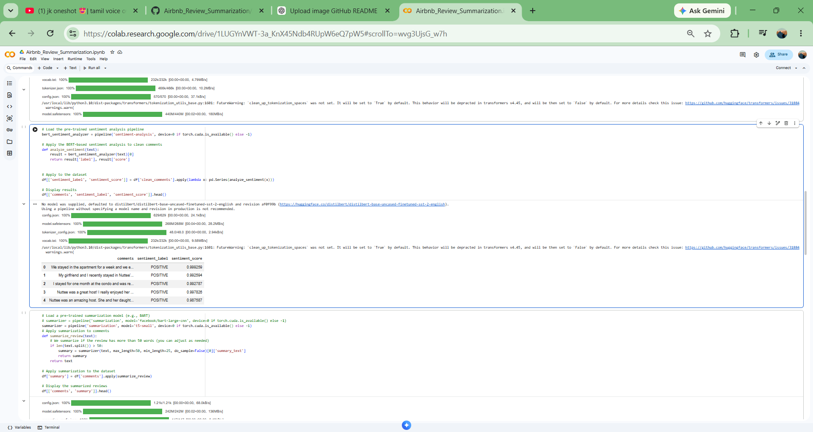
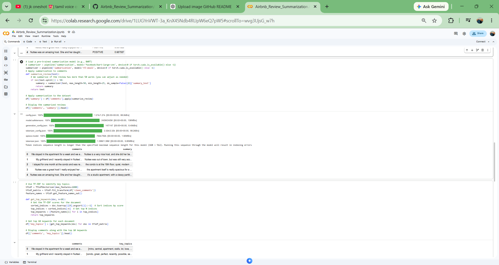

# 🏠 Airbnb Review Summarization & Sentiment Analysis using Transformers

An NLP-powered project that analyzes Airbnb customer reviews using Transformer-based models. The system performs sentiment analysis to identify customer opinions and generates concise summaries of lengthy reviews, helping users quickly understand guest experiences.

---

## 📸 Project Outputs

### Sentiment Analysis



### Review Summarization



---

# 📌 Project Overview

Airbnb listings often receive hundreds or thousands of reviews, making it difficult for users to read and understand all customer feedback.

This project leverages state-of-the-art Transformer models from Hugging Face to automatically:

* Classify review sentiment (Positive/Negative)
* Generate concise summaries of lengthy reviews
* Extract meaningful insights from customer feedback

The application demonstrates practical Natural Language Processing (NLP) techniques using pre-trained Transformer models.

---

# 🎯 Problem Statement

Reading large volumes of customer reviews is time-consuming and inefficient.

Users need a way to quickly understand:

* Overall customer satisfaction
* Positive and negative experiences
* Important information hidden within long reviews

### Goal

Build an NLP solution that automatically analyzes Airbnb reviews and generates meaningful summaries while preserving important information.

---

# 🔄 Approach

The project follows a complete NLP workflow:

**Data Collection → Text Preprocessing → Sentiment Analysis → Review Summarization → Result Generation**

---

# 📊 Step 1 — Data Collection

Collected Airbnb customer review data containing:

* Guest Comments
* Review Text
* Customer Feedback

The dataset serves as the foundation for both sentiment analysis and summarization tasks.

---

# 🧹 Step 2 — Text Preprocessing

Applied standard NLP preprocessing techniques:

* Text Cleaning
* Lowercasing
* Removing Unwanted Characters
* Handling Missing Values
* Preparing Reviews for Transformer Models

---

# 🤖 Step 3 — Sentiment Analysis

Used the pre-trained DistilBERT model from Hugging Face:

**Model:**

```text
distilbert-base-uncased-finetuned-sst-2-english
```

### Output

The model predicts:

* Sentiment Label

  * Positive
  * Negative

* Sentiment Confidence Score

### Example

| Review                          | Sentiment |
| ------------------------------- | --------- |
| Great host and clean apartment  | Positive  |
| Poor maintenance and noisy area | Negative  |

---

# 📝 Step 4 — Review Summarization

Implemented Transformer-based text summarization to generate concise summaries from lengthy Airbnb reviews.

### Benefits

* Reduces reading time
* Highlights important information
* Improves review exploration experience
* Maintains contextual meaning

### Example

**Original Review**

> We stayed in the apartment for a week and had a wonderful experience. The host was friendly and responsive, and the location was excellent.

**Generated Summary**

> Friendly host and excellent location with a great stay experience.

---

# 📈 Results

The project successfully:

✅ Classified review sentiment accurately

✅ Generated concise summaries

✅ Reduced information overload

✅ Improved understanding of customer feedback

---

# 🛠️ Tech Stack

| Technology                | Purpose                 |
| ------------------------- | ----------------------- |
| Python                    | Core Programming        |
| Pandas                    | Data Manipulation       |
| NumPy                     | Numerical Computing     |
| Hugging Face Transformers | NLP Models              |
| DistilBERT                | Sentiment Analysis      |
| PyTorch                   | Deep Learning Backend   |
| Jupyter Notebook          | Development Environment |

---

# 📂 Dataset

| Property  | Detail                            |
| --------- | --------------------------------- |
| Domain    | Airbnb Reviews                    |
| Data Type | Text Reviews                      |
| NLP Tasks | Sentiment Analysis, Summarization |
| Input     | Customer Comments                 |
| Output    | Sentiment Labels, Summaries       |

---

# 📊 Model Outputs

### Sentiment Analysis Output

* Customer Review
* Sentiment Label
* Confidence Score

### Summarization Output

* Original Review
* Generated Summary

---

# ▶️ Run Locally

### Clone Repository

```bash
git clone https://github.com/chandrikaj631/Airbnb_Review_Summarization.git
cd Airbnb_Review_Summarization
```

### Install Dependencies

```bash
pip install pandas numpy transformers torch
```

### Launch Notebook

```bash
jupyter notebook
```

Open the notebook and run all cells.

---

# 📁 Project Structure

```text
Airbnb_Review_Summarization/

├── Airbnb_Review_Summarization.ipynb
├── dataset.csv
├── images/
│   ├── sentiment_analysis.png
│   └── review_summarization.png
├── requirements.txt
└── README.md
```

---

# 🔮 Future Improvements

* Multi-language review analysis
* Aspect-based sentiment analysis
* Interactive Streamlit dashboard
* Review recommendation engine
* Real-time review processing
* Advanced summarization models

---

# 👩‍💻 Author

**Chandrika J**

Aspiring Data Scientist passionate about Machine Learning, Natural Language Processing, Power BI, and AI-powered applications.

GitHub: https://github.com/chandrikaj631

